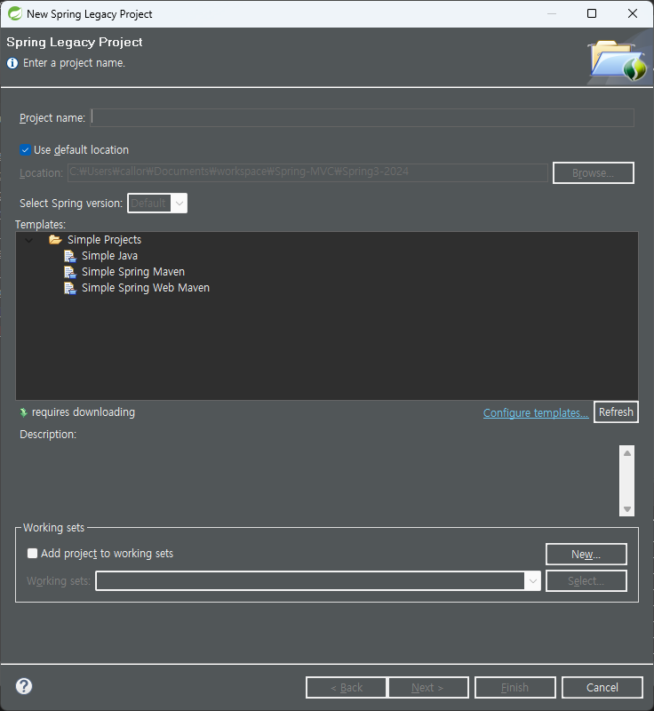
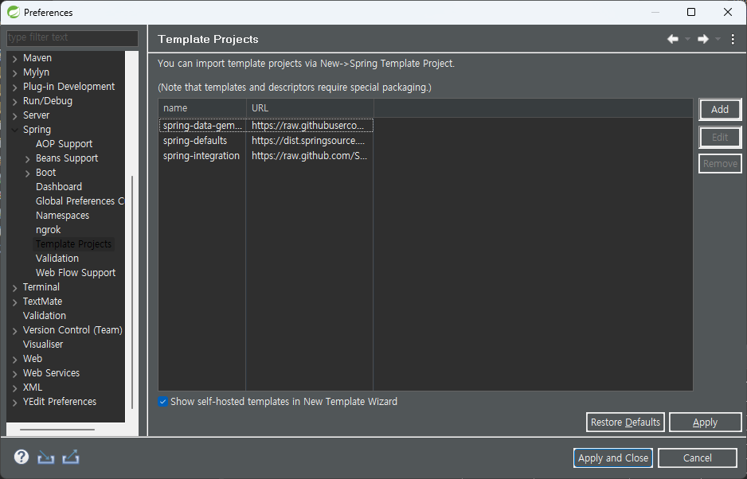
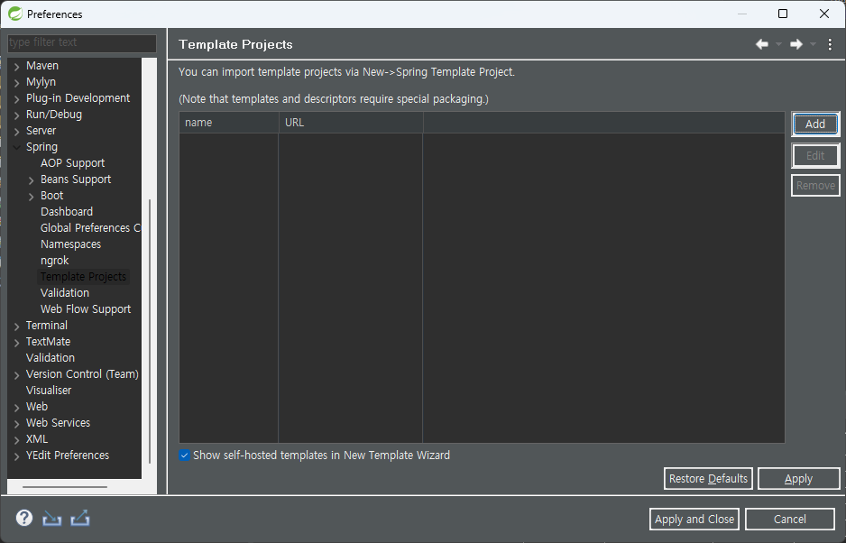
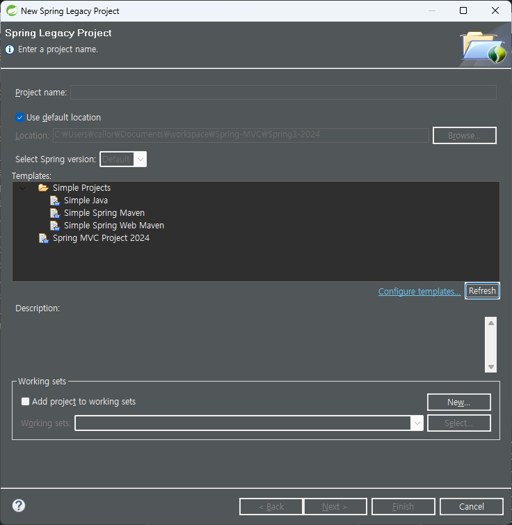

# Spring Legacy / Spring MVC 2024 Template

- STS 3 에서 Spring Legacy / Spring MVC 프로젝트를 생성할 수 있는 Template 입니다
- This is a template that can create Spring Legacy / Spring MVC in STS 3.

## STS 3 버전을 다운로드 받습니다

- [2024.03.21 다운로드 클릭](https://download.springsource.com/release/STS/3.9.18.RELEASE/dist/e4.21/spring-tool-suite-3.9.18.RELEASE-e4.21.0-win32-x86_64.zip)
- STS 3 는 언제까지 지원될지 알수 없는 상황이므로, 파일을 삭제하지 말고 보관하는 것이 좋겠습니다.

## Spring Legacy Template 을 다운로드 받습니다

- [2024.3.21 다운로드 클릭](https://github.com/callor/Callor-SpringMVC-Template-2024/releases/download/SpringLegacy/com.callor.templates.mvc-5.2.25.zip)
- 다운로드 받은 파일을 압축을 풀어 줍니다. 이때 폴더 이름을 잘 확인하세요
- 

## STS 3 에 적용하겠습니다.

- `STS 3` 를 실행하여 프로젝트를 작성할 `workspace` 폴더를 선택하고 IDE 화면이 나타날때까지 기다려 줍니다.
- `STS 3` 를 그냥 종료하고, 윈도우 탐색기에서 `workspace` 폴더를 찾아 갑니다.
- `.metadata` 라는 폴더가 생성되어 있을 것입니다
- 
- `.metadata` 폴더에 `.sts/content` 폴더를 만들고 압축해제한 template 폴더를 복사 붙여넣기 합니다
- 그리고 `STS 3`를 다시 실행합니다.

## Spring Legacy / Spring MVC 프로젝트 만들기

- `STS 3` 에서 `File / New / Spring Legacy` 를 차례로 클릭합니다
- 다음과 같이 보일 것입니다. 역시 Spring MVC 프로젝트는 보이지 않습니다.
  

- `Template Wizard` 화면에서 `Configure Template...` 이라는 링크를 클릭합니다.
- `Template Project` 화면이 나타납니다.
  
- 3개의 링크를 클릭하여 모두 `Remove` 합니다.
  
- 그리고 `Aplly/Close` 를 눌러 창을 닫습니다.
- 다시화면으로 돌아와서 `Refresh` 버튼을 클릭합니다
- 그러면 `Spring MVC 2024` 라는 `Template` 이 나타 납니다.
  

- 이제 Spring MVC 프로젝트를 예전처럼 사용하실수 있습니다.

## Spring MVC 2024 Template

- 기존의 Template 를 약간 수정하였습니다.
- `SpringFramework` 버전을 `5.2.25.RELEASE` 으로 변경
- `Java-version` 을 `java-11` 버전으로 변경
- `log`를 `logback-class 1.5.3`으로 변경
- `Servlet`, `JSP` 등의 새로운 버전으로 변경
- `web.xml` 을 `Dynamic 4.0` 으로 변경
- `servlet-context.xml` 의 `namespace` 를 일부 변경
- `/views/home.jsp` 파일 변경
